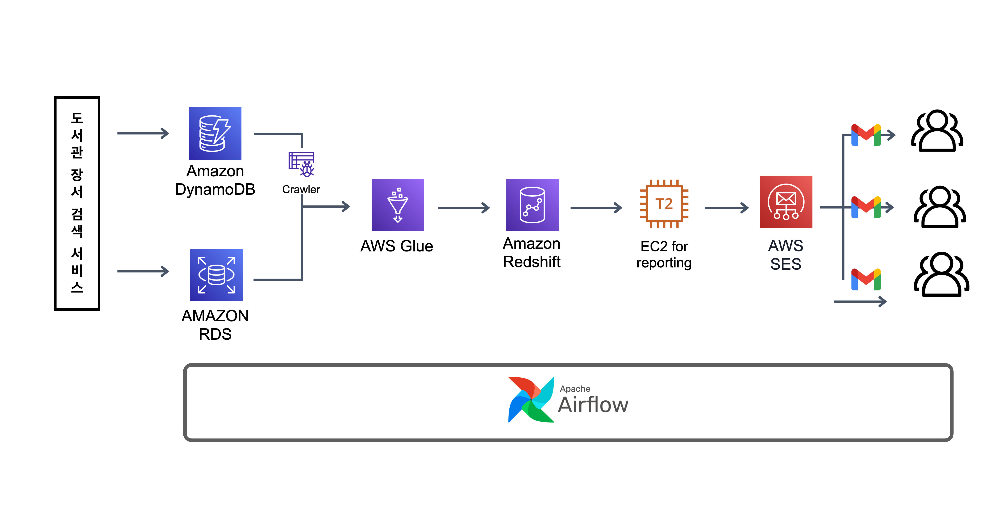
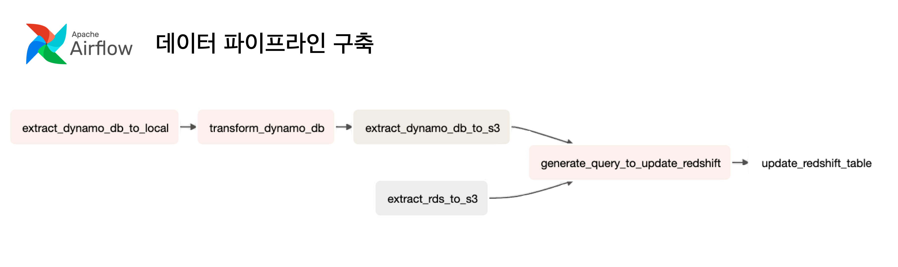
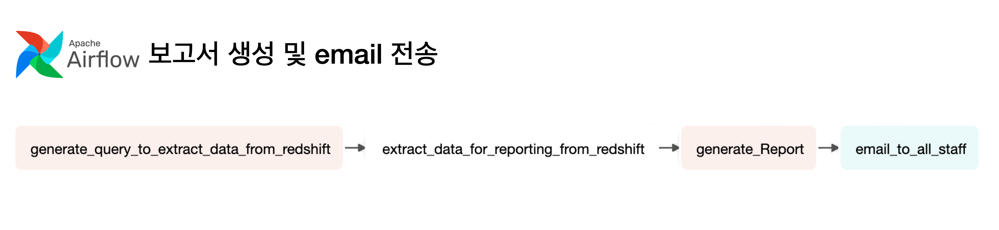

# 보고서 자동화를 위한 데이터 파이프라인 구축

<br/>

```
프로젝트 형태 : 1인 개발
프로젝트 기간 : 2023.05.12 - 2023.05.22(10일)
사용 기술 : Airflow, AWS Glue, AWS Redshift, Pandas, Pyspark, Matplotlib
```

<br/>

### 프로젝트 소개

- 보고서 자동화가 필요한 상황을 가정하고 이에 대한 AWS Cloud 기반의 데이터 파이프라인 구축

- 개인 프로젝트로 진행했던 도서관 장서 검색 서비스를 활용해 100만 건의 서비스 이용 데이터 생성
- 스키마리스 데이터 처리를 위한 ETL 파이프라인 설계 및 Data Warehouse 구축
- 보고서 활용 목적의 Data Mart 구축과 보고서 자동 생성 및 배포 프로세스 구현

<br/>

### 프로젝트 아키텍처



<br/>

### 시나리오 소개

- 도서관 장서 검색 서비스를 제공하는 기업의 데이터 엔지니어로서매일 아침 전 직원에게 일 단위 서비스 이용현황을 이메일로 공유해야한다.

- 서비스 이용 데이터는 일단위로 Data Warehouse에 저장해 데이터 분석가, PM 등 다른 구성원들이 이용할 수 있어야 하며, 보고서 자동화에 활용 될 Data Mart 구축이 필요하다.

- 사용자 요청 결과는 Dynamo DB에 저장되며 사용자 행동 데이터는 RDS에 저장된다.

<br/>

### 프로젝트 상세소개

#### ETL 프로세스 설계 및 Data Warehouse 구축



- 아래 구조를 가진 Dynamo DB 데이터를 Redshift에 저장할 수 있도록 array 유형의 데이터를 열 지향 데이터로 변환하는 ETL 프로세스 설계

  ```
    # Dynamo DB Item example.
    item = {
      query_id: "bdeca3e6-efe5-4728-9056-2464e931dec7",
      query_date: "2023-05-16",
      selected_lib: ["노원", "마포", "남산"],
      isbn13_list: ["9791163030645","9791186710340","9788956748245"],
      user_search: ["flask", "python","ML"],
    };
  ```

- AWS Glue와 Pyspark를 활용해 약 1,000만건의 데이터를 가공한 뒤 아래 데이터 구조로 Redshift에 저장

  ```
    # to isbn13_list

    |   isbn13_list |                             query_id |
    |--------------:|-------------------------------------:|
    | 9791163030645 | bdeca3e6-efe5-4728-9056-2464e931dec7 |

    # to selected_lib

    | selected_lib |                             query_id |
    |-------------:|-------------------------------------:|
    |         노원  | bdeca3e6-efe5-4728-9056-2464e931dec7 |

    # to user_search

    | user_search  |                             query_id |
    |-------------:|-------------------------------------:|
    |       flask  | bdeca3e6-efe5-4728-9056-2464e931dec7 |

  ```

<br/>

#### Data Mart 구축 및 보고서 생성 및 배포 프로세스 구현



- Redshift에 저장된 데이터에서 보고서 생성에 필요한 데이터를 추출해 Data Mart 구축

- 분석 보고서는 어느 환경에서나 열람 가능하도록 HTML 파일로 생성

- AWS SES를 활용해 전직원에게 일일 보고서를 email로 전송하도록 구현

<br/>

### 프로젝트를 통해 느낀점 : 워크플로우 관리도구의 필요성

기획 초기 AWS Eventbridge, S3 Notification, Amazon SNS 등을 활용해 데이터 파이프라인 자동화를 구상했습니다. AWS 서비스를 이용해 데이터 파이프라인을 구축하는 만큼, Eventbridge나 SNS을 사용하는 것이 사용면에서 간편하고 호환성에서도 장점이 있다고 판단했습니다.

하지만 데이터 파이프라인을 구축하는 과정에서 워크플로우 관리 도구없이 AWS Eventbridge, S3 Notification, Amazon SNS만으로 자동화를 구현하는 방식이 매우 비효율적이며, 실수를 증가시키는 방식임을 깨달았습니다. 특히 다른 누군가가 제가 만든 파이프라인을 이해하거나 보수해야할 필요가 생길 경우 파이프라인 구조를 이해하는데 상당한 어려움을 가질것이라 생각했습니다.

이러한 이유로 워크플로우 관리도구인 airflow를 도입했습니다. 직접 사용해보며 느꼈던 점으로는

- AWS 서비스 전용 오퍼레이터를 지원해 태스크 생성이 간단하며, Pyspark, Pandas 등 파이썬 기반의 전처리 태스크 또한 간단히 구축할 수 있어 빠르게 배우고 쉽게 적응할 수 있었습니다.

- 워크플로우 변동사항이 실시간으로 다이어그램에 반영되고, 배치 프로세스가 실패하더라도 어떠한 태스크가 성공하고 실패했는지 한 번에 확인 가능하므로 파이프라인 관리에 있어 효율적이었습니다.

- 파이썬 코드로 파이프라인이 관리되는 만큼 파이프라인을 템플릿화하여 빠르고 간편하게 새로운 데이터 파이프라인을 구축할 수 있는 편리함이 있었습니다.

해당 프로젝트를 수행하며 데이터 파이프라인 구축에 필요한 서비스와 관련 기술을 숙달하는 것 외에도, 많은 기업에서 Airflow를 사용하는 이유를 이해하고 그 효율성을 직접 체감했다는 점에서 가치가 있다고 생각합니다.
